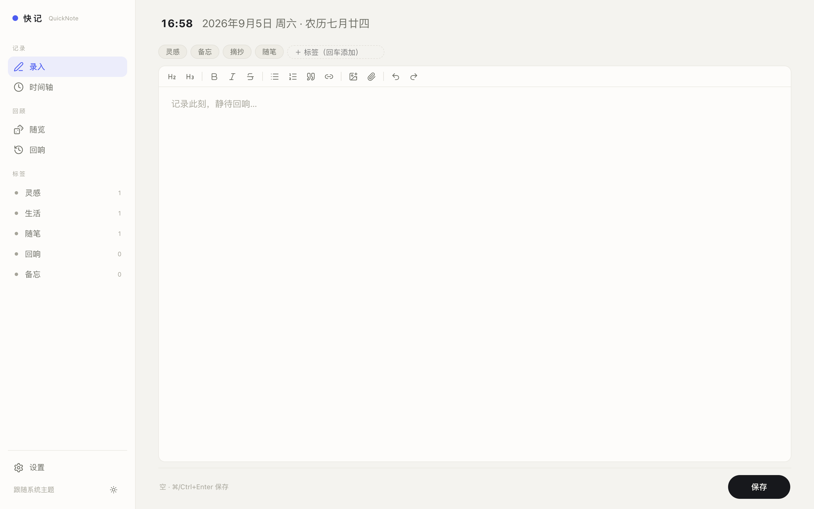
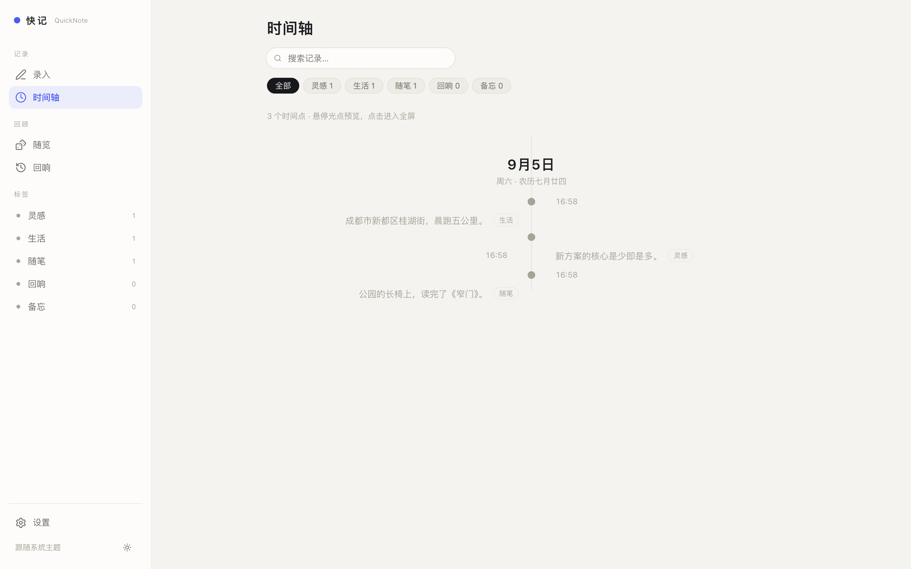

<p align="center">
  
</p>

<h1 align="center">快记 · QuickNote</h1>

<p align="center">极简「随手记 + 时光轴」，本地优先。第一屏即录入，保存即化作时间线上的光点。</p>

<p align="center">
  <a href="LICENSE"></a>
  = 23.4" />
  
  
</p>

---

## ✨ 特性

- **首屏即录入**：右侧工作区即编辑窗，所见即所得（Tiptap 富文本），⌘/Ctrl+Enter 快速保存，**输入即存草稿**（防误触丢失）
- **图形化时间轴**：中心线 + 左右交替节点（组件化 `TimelineItem`，VueUse 滚动入场），移动端自动切靠左单列
- **粘贴 URL 自动嵌入**：YouTube / Bilibili / Apple Music → 内嵌播放器；普通网页 → Nothing 风链接卡（favicon + 标题/描述 + 缩略图 + 域名）
- **图片 / 附件**：拖拽、粘贴、按钮上传；附件**任意格式、不限大小**
- **随览 & 回响**：随机拾取一个时间点；回响展示**所有年份**「同月今日」时刻，按年份分组
- **日期增强**：公历节日 / 农历日期与节日 / 节气（`lunar-javascript`）
- **明暗主题**：浅色 / 深色 / 跟随系统；**3 套字体方案**（中英文成对）+ 实时预览
- **标签与检索**：编辑时点选，时间轴/侧栏筛选；纯文本关键字检索
- **备份**：单向 WebDAV（手动 + 定时），本地保留最近 5 份快照
- **本地 & PWA**：无账号、单机运行；移动端（顶条 + 底 Tab）与「添加到主屏幕」

## 🖼 截屏

| 录入 | 时间轴 |
| --- | --- |
|  |  |

## 🚀 快速开始（macOS / Linux）

```bash
npm install        # 根目录 npm workspaces，一次装齐前后端
npm run dev        # 后端(3987) + Vite(5173)
```

浏览器打开 http://127.0.0.1:5173 （Vite 已代理 `/api` 与 `/images` 到后端）。

## 🖥 生产部署（Linux 单进程）

```bash
npm install
npm run build      # 产出 web/dist，后端自动托管
node server/src/index.js
# → http://127.0.0.1:3987
```

常驻运行用 systemd：`sudo cp deploy/quicknote.service /etc/systemd/system/ && sudo systemctl daemon-reload && sudo systemctl enable --now quicknote`；日志 `journalctl -u quicknote -f`。

| 环境变量 | 默认 | 说明 |
| --- | --- | --- |
| `QUICKNOTE_HOST` | `127.0.0.1` | 监听地址（`0.0.0.0` = 开放局域网） |
| `QUICKNOTE_PORT` | `3987` | 端口 |
| `QUICKNOTE_DATA` | `<项目>/server/data` | 数据目录 |

### 冒烟测试

```bash
npx playwright install chromium   # 首次（约 80MB）
npm run build
node server/src/index.js          # 或 npm run dev -w server
npm run smoke                     # 桌面 + 移动关键路径 22 项断言
```

## 📱 移动端访问（局域网，风险自知）

无账号体系：开放局域网后，同网任何能访问该端口者均可读写。仅限可信 WiFi。

```bash
QUICKNOTE_HOST=0.0.0.0 node server/src/index.js   # 启动日志会打印局域网地址
```

systemd 里取消 `Environment=QUICKNOTE_HOST=0.0.0.0` 注释并重启；放行防火墙 `3987/tcp`（firewalld/ufw）。手机开 `http://<电脑IP>:3987`，浏览器「添加到主屏幕」即 PWA 全屏。

## 🧱 技术栈

| 层 | 技术 |
| --- | --- |
| 前端 | Vue 3 · Vite · Tiptap（所见即所得富文本）· Lucide 图标 · VueUse（滚动动画） |
| 后端 | Node.js（≥ 23.4，推荐 24 LTS）· Express · 内置 `node:sqlite`（零原生编译依赖） |
| 日期 | `lunar-javascript`（公历/农历节日、节气） |
| 存储 | SQLite 单文件 `server/data/quicknote.db`；图片 `server/data/images/`；附件 `server/data/attachments/` |

## 📁 目录结构

```
├── server/            # Node 后端
│   └── src/
│       ├── index.js        # 入口：API + 静态托管 + 定时备份调度
│       ├── config.js       # 目录/端口/配置读写（server/data/config.json）
│       ├── db.js           # node:sqlite；content(净化HTML)+plain(纯文本) 双列存储
│       ├── routes/         # notes / tags / images / attachments / unfurl / backup
│       └── backup/         # 本地快照 zip + WebDAV 上传
├── web/               # Vue 3 前端
│   ├── public/             # PWA 图标 / manifest
│   └── src/
│       ├── views/          # WriteView(录入) / TimelineView(时间轴) / SettingsView(设置)
│       ├── components/     # TipTapEditor / TimelineItem / MomentCard / FullNoteModal / 随览 / 回响
│       ├── embed.js        # 链接→嵌入组件（YouTube/Bilibili/Apple/网页卡）
│       ├── datecn.js       # 公历/农历/节日/节气 格式化
│       └── rich.js         # 净化与统计（DOMPurify）
├── scripts/smoke.mjs  # Playwright 冒烟测试（桌面+移动）
├── deploy/            # systemd 单元示例
└── LICENSE            # MIT
```

## 📡 API

| 方法 | 路径 | 说明 |
| --- | --- | --- |
| GET | `/api/notes?q=&tag=&sort=&order=&from=&to=` | 列表（`q` 对纯文本检索；`from/to` 为 YYYY-MM-DD 按创建日过滤） |
| POST | `/api/notes` | 新建 `{content: 净化 HTML, plain: 纯文本, tags[]}` |
| GET/PUT/DELETE | `/api/notes/:id` | 单条记录（PUT 同 POST 载荷） |
| GET | `/api/tags` | 标签与计数 |
| POST | `/api/images` | 图片上传（字段 `file`），返回 `/images/xxx` |
| POST | `/api/attachments` | 附件上传（任意格式、不限大小），返回 `{url,name,size}` |
| GET | `/api/unfurl?url=` | 抓取网页 Open Graph 元信息（标题/描述/封面），供链接卡片 |
| GET/PUT | `/api/backup/config` | 备份配置 |
| POST | `/api/backup/run` | 立即备份（本地 zip + WebDAV 上传） |

## 📄 许可

[](LICENSE)

## 🗺 开发计划

**本期已完成**：所见即所得编辑器、图形化时间轴、随览/回响、嵌入组件（YouTube/Bilibili/Apple Music + 网页链接卡）、图片/附件上传、明暗主题与字体方案、WebDAV 备份。

**待办**：

- 多图上传、孤儿图片/附件清理
- 从备份恢复入口
- 远端网页图片抓取到本地
- 更多平台嵌入（腾讯视频 / 网易云 / Spotify 等）
- 法定节假日调休表、字体文件上传

---

<p align="center">Made with 🖤 · 本地优先的个人记录工具</p>
